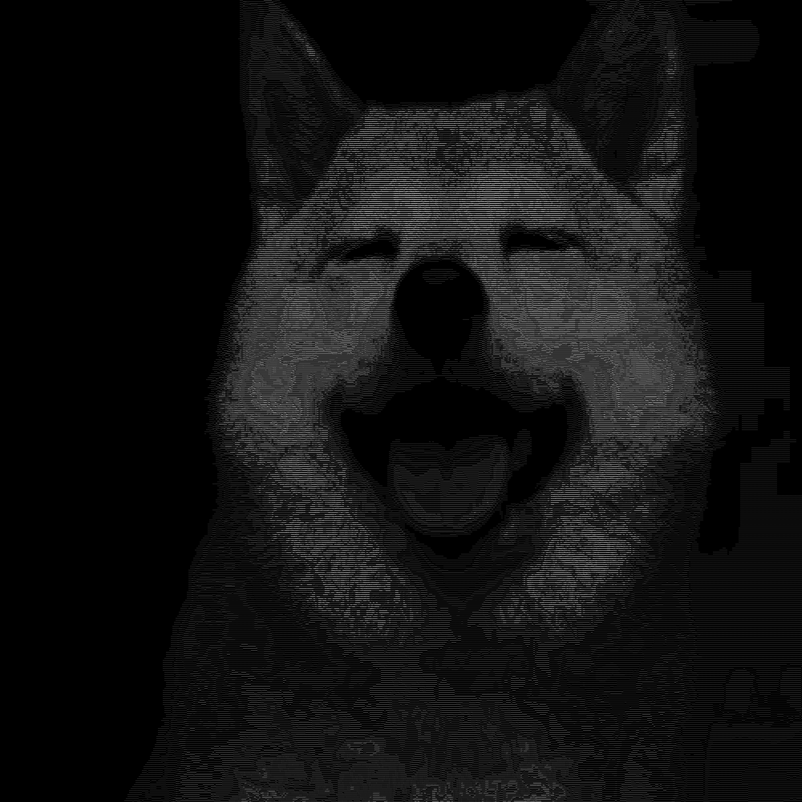

# ascii-art

## Comparison

### Gamma = 2.2

|                      Float                      |                      Index                      |          Original           |
| :---------------------------------------------: | :---------------------------------------------: | :-------------------------: |
|  |  |  |

### Gamme = 1.0

|                    Float                    |                    Index                    |          Original           |
| :-----------------------------------------: | :-----------------------------------------: | :-------------------------: |
|  |  |  |